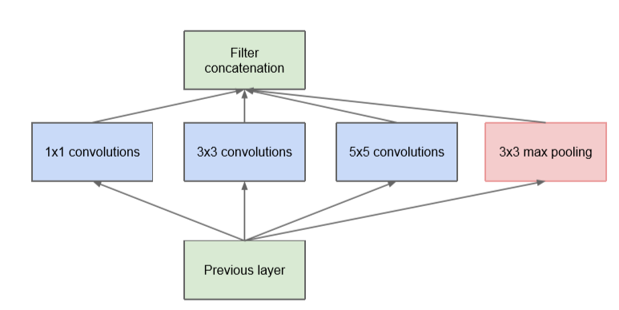
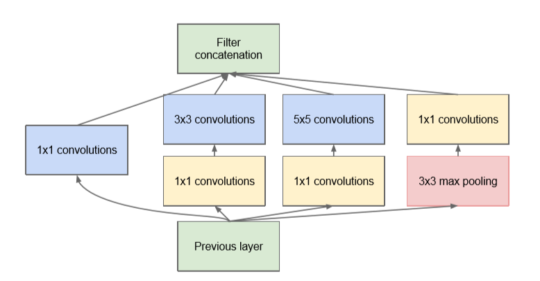
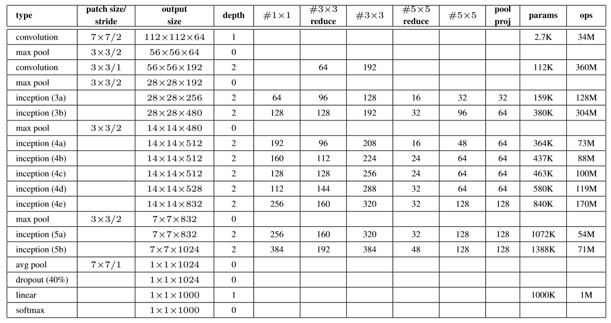

# GoogLeNet_keras_custom
build GoogLeNet with keras after reading paper.
### GoogLeNet论文学习与keras实现
***
### V1版本
#### Inception结构
对于当时的网络结构，为了提高效果，可以有两种选择：
1. 增加深度
2. 增加宽度

而单纯的进行深度、宽度的增加会带来一定的缺陷：
* 更深的网络导致庞大的参数量，更容易导致过拟合。
* 更大的网络也会导致更大的计算代价的产生。

这篇paper主要的特征就是提出了inception的结构，这种结构通过在不同尺度上提取特征并组合，可以使图像得到更好的表征。
在单纯增加网络深度的情况上，也增加了网络的宽度，比同期的VGG模型少了更多需要训练的参数。
探讨一下inception的结构。

这是**初期**的一个inception想法，对上一层直接分别使用1x1、3x3、5x3和3x3max pooling的操作，并对产生的结果层进行concatenated（此处，作者选择这几种模式的卷积操作只是因为方便，现在的情况下因为计算能力的提升可以更加自由的设计更多规格的inception层）。而这种初期的inception有着相同的计算缺陷——计算量大。可以知道，就算是5x5的卷积核在后期的操作中所需要的计算代价也是昂贵的，特别是将pool后的网络层和conv操作后的网络层进行合并，会在短短几个阶段内造成计算量的爆炸。为了解决这个问题，作者提出了下一个版本的inception的构思。

实际使用版本的inception在每个卷积操作和max后进行了一定量的1x1的卷积操作，通过1x1的卷积。1x1的卷积操作的灵感来源于net in net的结构，有如下几个优势：

* 1x1的卷积操作可以降低输入数据的channel数量，减少计算量，达到一个降维的操作；
* 除去降维的作用，1x1卷积操作还有作为线性修正单元的作用。

#### 网络结构

GoogLeNet的网络结构如上表所示，总共层数是22层（不包括pooling layer）。

##### 注意
* 输入时224x224x3的图像，图像的预处理作者没有提出一个固定的思路，因为在比赛前几个月一直都在改变，大概是从其他paper得到的灵感分别进行训练：如alexnet的进行5种类型的随机裁剪、水平翻转等。
* 所有的激活函数使用的都是relu函数。
* #1x1、#3x3、#5x5表示的是inception里三种类型的卷积核的数量，而#3x3reduce、#5x5reduce表示的是之前作用的1x1的卷积核的数量，poolproj表示的是池化操作后进行的1x1卷积核数量。
* 在最后使用了一个平均池化层。
* 最后的输出使用了线性层代替全连接层，这样做的目的是增加网络的泛化性，使网络能适应卡labels，这是更加方便的。（不过最后好像还是用全连接层来代替了...）
* 在inception_4b和inception_4d的地方作者还输出了两个额外的softmax，最后通过权重0.3的比例和最终的softmax共同计算loss。（**不过在之后的版本中取消了这个做法，直接采用最终的1个softmax计算loss。**）

#### 初始化
* 采用sgd作为optimizer。
* 初始learning rate为0.01，momentum为0.9。
* 采用学习率下降的算法，每经过8个epochs，学习率下降4%。

#### 实现
* GoogLeNet除了作为分类网络，还可以进行检测。
* 实现中只实现了分类的功能，并且只采用了最终1个输出进行计算loss。
* 使用的cifar10数据集。

### v2版本
* 使用VGG的想法,用2个3x3的卷积来代替5x3的卷积,达到减少参数,提高计算速度和性能的目的.
* 将nxn的卷积分解成1xn和nx1的卷积组合.如3x3的卷积分解为:先执行1x3卷积,再在其输出上执行3x1的卷积.这样能够得到更加便宜的计算量.
* 将分解的filter组扩展宽而不是加深,如对上一层同时进行1x3和3x1的卷积,而不是连续进行卷积.目的为了消除代表性瓶颈,当模块加深,会导致图像尺寸的过度减少,以至于丢失信息.

### v3版本
* 使用了RMSProp优化器.
* 加入了更大的卷积,输入从224x224变为299x299,更加精细地设计模块.
* 使用了BatchNorm加速收敛.
* 使用了标签平滑.

### v4版本
* 修改了stem,即引入inception之前的初始操作集.
* 引入了专门实现reduce功能的模块"**reduction blocks**".
* inception模块做了细节上的修改.
